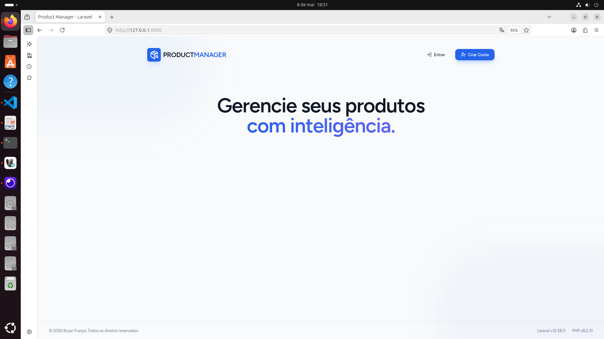
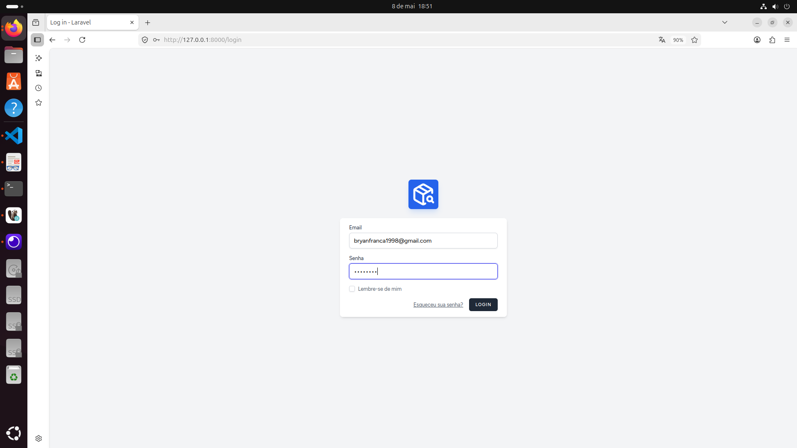
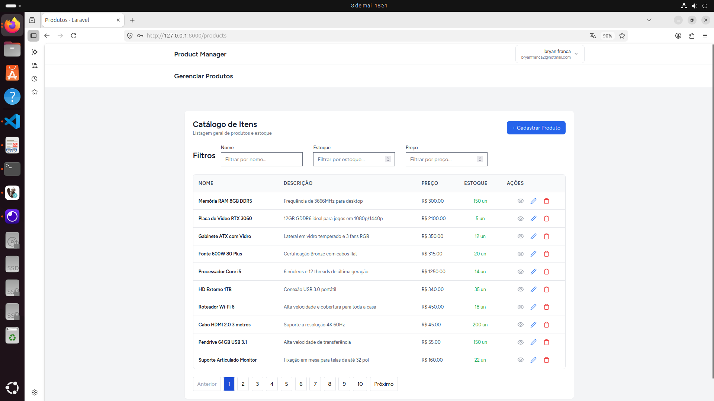
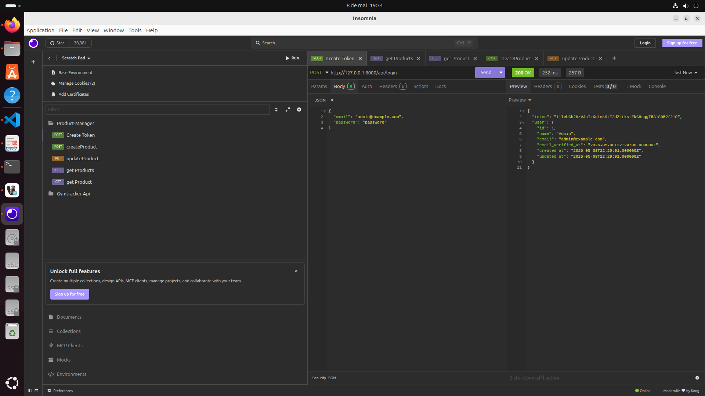
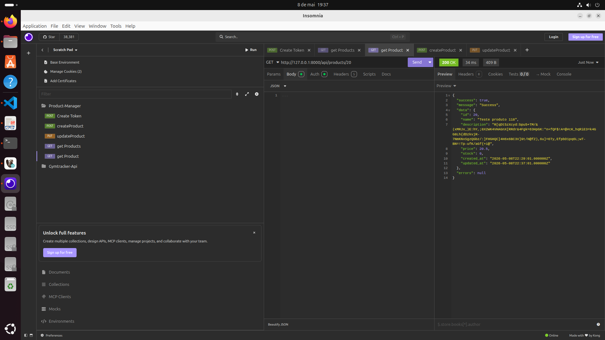

# Product Manager

Projeto desenvolvido como parte do teste técnico para a vaga de Desenvolvedor PHP da First Decision.

Aplicacao web para gerenciamento de produtos, com interface em Laravel + Vue via Inertia e API REST protegida por Laravel Sanctum. O projeto contempla autenticacao, CRUD de produtos, filtros, paginacao, validacoes, cache com Redis, testes automatizados e ambiente Docker com Makefile.

## Tecnologias

- PHP 8.2
- Laravel 12
- Laravel Sanctum
- Vue 3
- Inertia.js
- TypeScript
- Tailwind CSS
- MySQL 8
- Redis
- Docker
- PHPUnit
- Jest

## Funcionalidades

- Autenticacao de usuarios
- CRUD completo de produtos
- API REST protegida com Laravel Sanctum
- Listagem paginada de produtos
- Busca por nome
- Filtros por preco e estoque
- Validacao de dados no backend
- Cache de listagem com Redis Tags
- Logs para criacao, atualizacao, remocao e leitura via cache
- Testes unitarios e de integracao no backend
- Testes unitarios no frontend
- Aplicação de princípios SOLID

## Como executar

### Pre-requisitos

- Docker
- Docker Compose
- Make

### Subindo o projeto

```bash
git clone https://github.com/bryan-fm/product-manager.git
cd product-manager
make setup
make up
```

A aplicacao estara disponivel em:

```txt
http://localhost:8000
```

O comando `make setup` copia o `.env.example`, sobe os containers, instala as dependencias PHP e JavaScript, gera a chave da aplicacao, executa migrations com seeders, gera o build frontend e limpa caches do Laravel.

## Usuario padrao

```txt
Email: admin@example.com
Senha: password
```

## Comandos uteis

```bash
make help      # Lista os comandos disponiveis
make setup     # Prepara e sobe o projeto do zero
make up        # Sobe os containers
make down      # Para os containers
make bash      # Acessa o container da aplicacao
make migrate   # Recria o banco e executa os seeders
make test      # Executa testes backend e frontend
make logs      # Exibe logs dos containers
```

## Testes

Para executar toda a suite configurada no Makefile:

```bash
make test
```

O comando executa:

```bash
docker compose exec app php artisan test
docker compose exec app npm run test:unit
```

## API

A API esta disponivel em:

```txt
http://localhost:8000/api
```

Health check:

```http
GET /api
```

Autenticacao:

```http
POST /api/login
```

Produtos, com autenticacao via Bearer Token:

```http
GET    /api/products
POST   /api/products
GET    /api/products/{product}
PUT    /api/products/{product}
PATCH  /api/products/{product}
DELETE /api/products/{product}
```

Filtros disponiveis na listagem:

```txt
search  Busca por nome
price   Filtra por preco
stock   Filtra por estoque
page    Pagina da listagem
```

Exemplo:

```http
GET /api/products?search=mouse&price=99.90&stock=10
```

## Arquitetura e boas praticas

- Service Layer para concentrar regras de negocio
- Repository Pattern para isolar acesso a dados
- DTO para transporte dos dados de produto
- Form Requests para validacao
- API Resource e respostas padronizadas
- Enum para diferenciar origem das operacoes
- Cache com Redis Tags para listagens
- Invalidation de cache em criacao, atualizacao e remocao
- Testes cobrindo service, repository, model, requests, controller e integracao

## Evidencias

Foram registradas capturas de tela da aplicacao e das chamadas de API durante a validacao do projeto.

## Melhorias futuras

- Adicionar rate limiting especifico para a API
- Adicionar pipeline de CI/CD
- Ampliar observabilidade com metricas e tracing
- Implementar soft delete em produtos
- Expandir a cobertura de testes end-to-end

## Screenshots

### Home



### Login



### Listagem de produtos



### API REST




